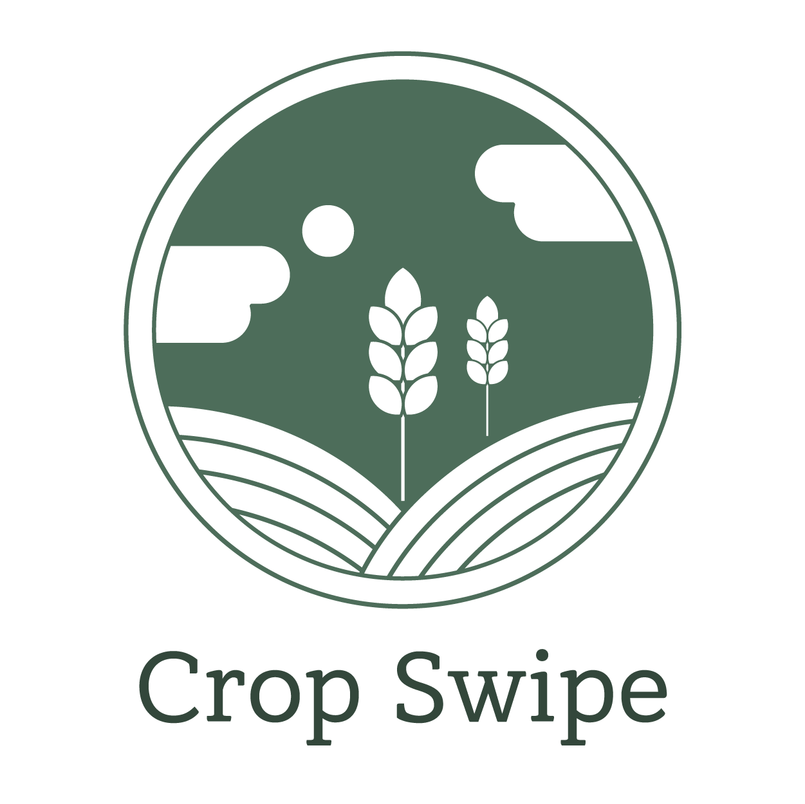

# Team Logo
<p align="center"></p>

# 1. Setup

```sh
# 0. clone fork project
git clone https://github.com/CropSwipe/crop-swipe-front-end.git

# 1. package install
npm install

# 2. run
npm run start
```

# 2. OverView
Crop Swipe 프로젝트는 농작물 공동구매 서비스이며 해당 레포지토리는 ReactJS를 이용하여 Crop Swipe의 FrontEnd 코드를 저장하고 있다.

# 3. Service Detail
추후에 추가 예정

# 4. Tech stack

### FrontEnd


 

### :computer: Contributor

|임동혁|
|:---:|
| FE |
||
|[@ldhbenecia](https://github.com/ldhbenecia)|
